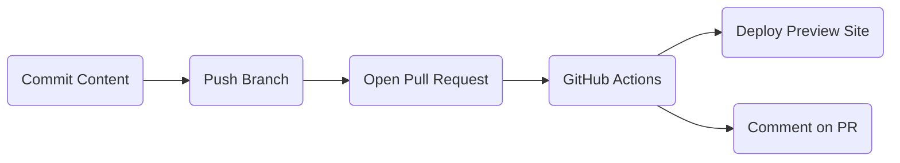
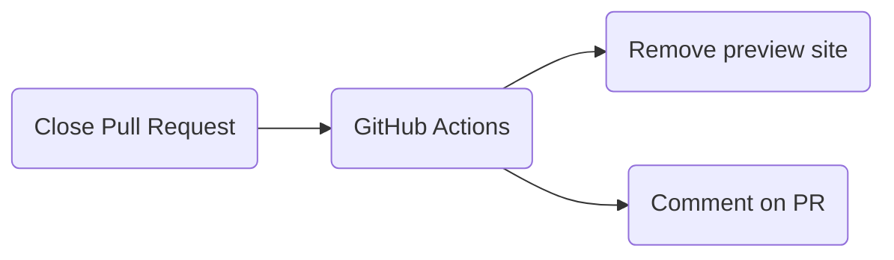

# How to Contribute

We'd love to accept your patches and contributions to this project. There are
just a few small guidelines you need to follow.

## Contributor License Agreement

Contributions to this project must be accompanied by a Contributor License
Agreement. You (or your employer) retain the copyright to your contribution;
this simply gives us permission to use and redistribute your contributions as
part of the project. Head over to <https://cla.developers.google.com/> to see
your current agreements on file or to sign a new one.

You generally only need to submit a CLA once, so if you've already submitted one
(even if it was for a different project), you probably don't need to do it
again.

## Community Guidelines

This project follows [Google's Open Source Community
Guidelines](https://opensource.google/conduct/).

## Production Content

This repository [publishes guideline content](https://googlecloudplatform.github.io/samples-style-guide/) using GitHub Pages.

## Code Reviews

All submissions, including submissions by project members, require review. We
use GitHub pull requests for this purpose. Consult
[GitHub Help](https://help.github.com/articles/about-pull-requests/) for more
information on using pull requests.

## Change the Website

* **File an Issue**: "Site request" in the [new issue chooser](https://github.com/GoogleCloudPlatform/samples-style-guide/issues/new/choose).

* Changes to guideline language may need to go through the Guideline Update
  process which has more overhead.
  Be restrained in updating language and grammar.

## Proposing a Global Guideline Change

* **File an Issue**: "Propose guideline" in the [new issue chooser](https://github.com/GoogleCloudPlatform/samples-style-guide/issues/new/choose)
* We may provide feedback on a problem; however, issues with specific proposals
  take priority
* Global guidelines must be approved by representatives of each language

## Proposing a Language-specific Guideline Change

* **File an Issue**: "Propose guideline" in the [new issue chooser](https://github.com/GoogleCloudPlatform/samples-style-guide/issues/new/choose)
* We may provide feedback on a problem; however, issues with specific proposals
  take priority
* Language-specific changes should be approved by the a representative of the
  language

## Proposing a New Language

To add a new language to the samples style guide:

1. The following prerequisites are met:

   * Google Cloud is making an official effort to maintain a growing collection of
     samples in that language.
   * A representative of the language is active on the Samples Steering Committee.
   * The guideline is drafted and has necessary internal review from language and
     samples stakeholders.

2. Open a Pull Request to add the language to the style guide:

   * Create a Pull Request to add language-specific guidance to the style guide
   * Each guideline must be addressed. If a guideline does not apply, note that
     explicitly.
   * Include new language-specific guidelines as needed
   * Code examples may be required on a case-by-case basis
   * Prefer adding to the existing guide rather than creating new pages

## Content Preview

**Note: This functionality does not currently support forks.**

Pull Requests proposing content changes from will automatically publish content
to a temporary preview site. The URL will be linked in a comment on the PR.
When the PR is closed, the preview site will be deleted.

This preview expedites reviews and discussions of content changes.

### Creating a new site preview

### Cleaning up a site preview

