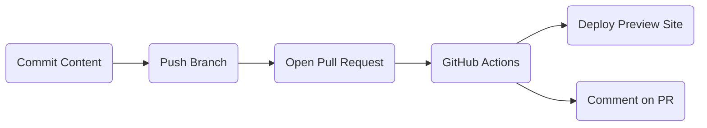
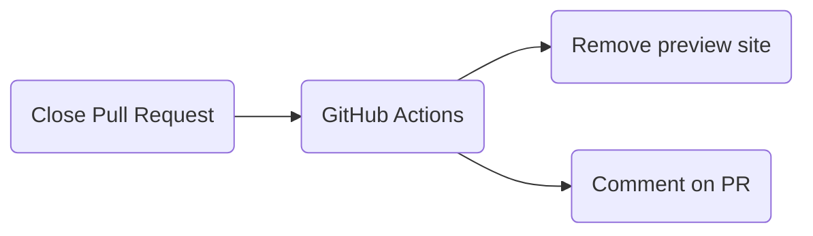

# How to Contribute

We'd love to accept your patches and contributions to this project. There are
just a few small guidelines you need to follow.

## Contributor License Agreement

Contributions to this project must be accompanied by a Contributor License
Agreement. You (or your employer) retain the copyright to your contribution;
this simply gives us permission to use and redistribute your contributions as
part of the project. Head over to <https://cla.developers.google.com/> to see
your current agreements on file or to sign a new one.

You generally only need to submit a CLA once, so if you've already submitted one
(even if it was for a different project), you probably don't need to do it
again.

## Production Content

This repository [publishes guideline content](https://googlecloudplatform.github.io/samples-style-guide/) using [GitHub Pages].

## Code Reviews

All submissions, including submissions by project members, require review. We
use GitHub pull requests for this purpose. Consult
[GitHub Help](https://help.github.com/articles/about-pull-requests/) for more
information on using pull requests.

## Content Preview

Pull Requests proposing content changes will automatically publish content
to a temporary preview site. The URL will be linked in a comment on the PR.
When the PR is closed, the preview site will be deleted.

This preview expedites reviews and discussions of content changes.

### Creating a new site preview

### Cleaning up a site preview

## Community Guidelines

This project follows [Google's Open Source Community
Guidelines](https://opensource.google/conduct/).